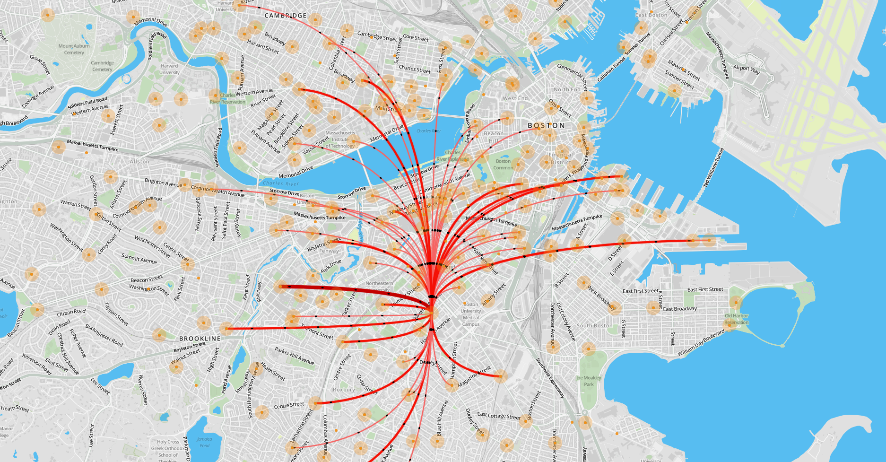

# LeafletFlowmapBLUEbikes

This web map application visualizes trip data from a bike sharing service using flow maps.
It uses [LeafletJS](https://leafletjs.com/) as a basis and creates flow lines using the plugin [Leaflet.Canvas-Flowmap-Layer](https://github.com/jwasilgeo/Leaflet.Canvas-Flowmap-Layer).

# THE MAP

# ADDITIONAL PLUGINS

# THE DATA

This site was built using [GitHub Pages](https://nelsonschaefer.github.io/LeafletFlowmapBLUEbikes/).
